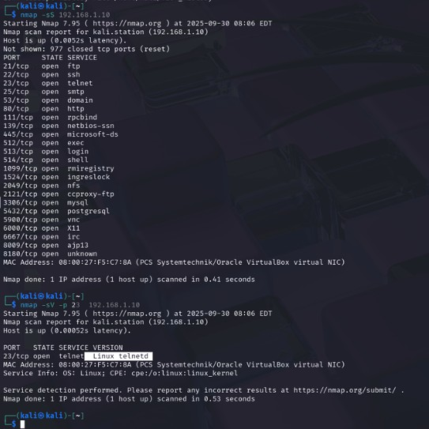
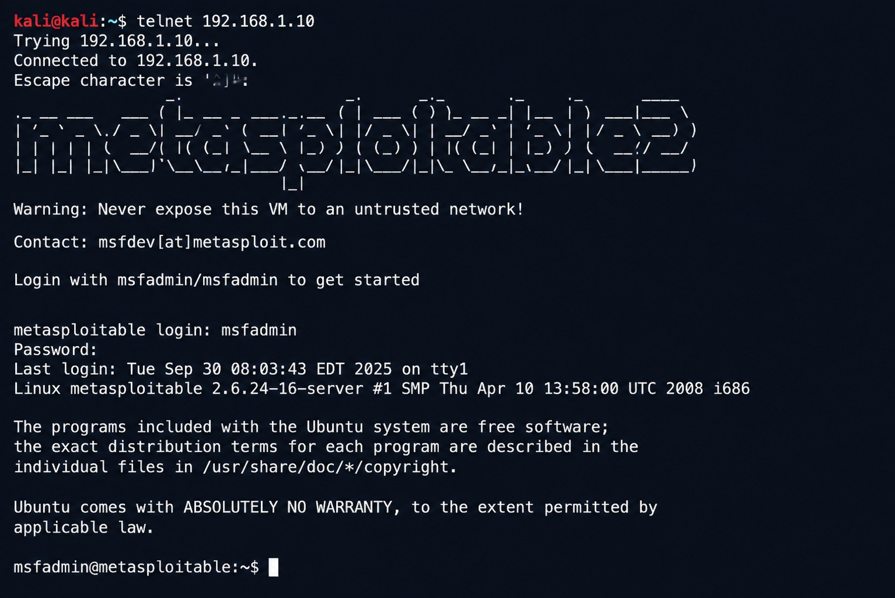

# Network Service Enumeration Lab

## Obiettivo

Individuare porte e servizi esposti da una macchina vulnerabile, identificarne le versioni e verificare eventuali vulnerabilità in un ambiente di laboratorio controllato.

## Ambiente

- VirtualBox
- Kali Linux
- Metasploitable
- Nmap
- Metasploit Framework

## Attività svolte

- Scansione TCP SYN della macchina target con Nmap
- Individuazione delle porte e dei servizi esposti
- Analisi delle versioni dei servizi individuati
- Analisi specifica del servizio FTP sulla porta 21
- Ricerca di moduli Metasploit compatibili con i servizi vulnerabili individuati
- Configurazione delle opzioni richieste dai moduli
- Test sui servizi FTP, SSH e Telnet
- Simulazione di brute force SSH tramite wordlist
- Verifica dell'accesso alla macchina target tramite shell

## Comandi Nmap utilizzati

Scansione TCP SYN per individuare le porte aperte:

`nmap -sS -T4 <TARGET_IP>`

Analisi della versione del servizio FTP sulla porta 21:

`nmap -sV -p 21 <TARGET_IP>`

Analisi della versione del servizio SSH sulla porta 22:

`nmap -sV -p 22 <TARGET_IP>`

Analisi della versione del servizio Telnet sulla porta 23:

`nmap -sV -p 23 <TARGET_IP>`

## Risultato

Il laboratorio mi ha permesso di applicare un processo di enumeration e vulnerability assessment, partendo dall'individuazione dei servizi esposti fino alla verifica pratica delle vulnerabilità individuate.

> Tutte le attività descritte sono state eseguite esclusivamente su macchine virtuali di laboratorio predisposte a scopo formativo e in un ambiente autorizzato.

## Evidenze del laboratorio

### Network enumeration con Nmap

### Accesso Telnet alla macchina Metasploitable

