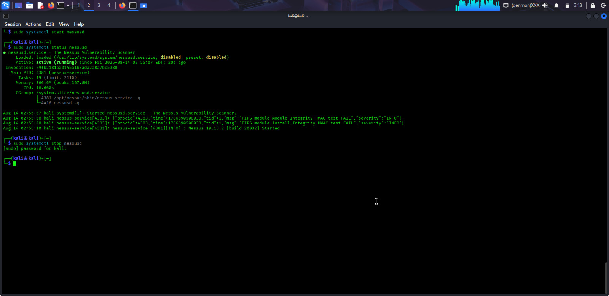
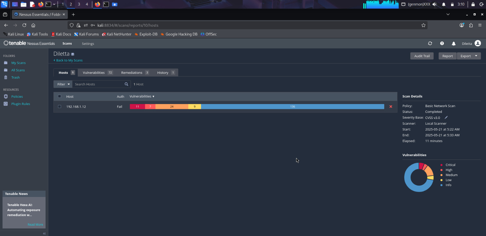
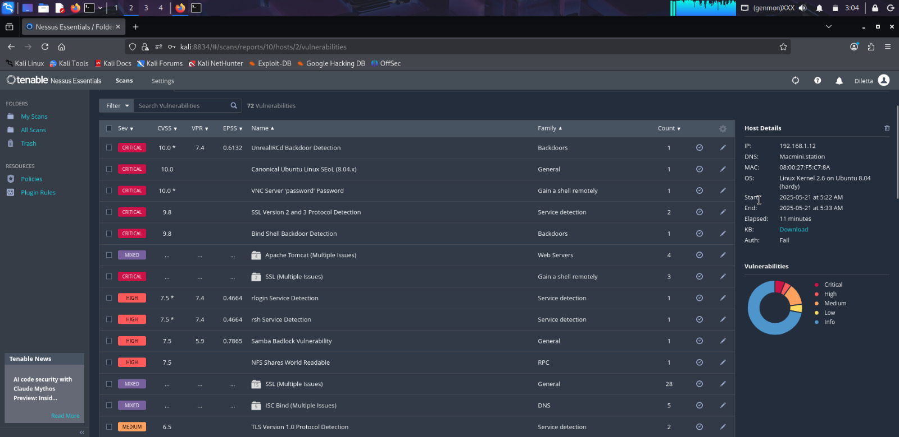

# Vulnerability Assessment Lab

## Obiettivo

Eseguire un vulnerability assessment su una macchina vulnerabile in ambiente virtualizzato, individuando e analizzando le vulnerabilità rilevate.

## Ambiente

- VirtualBox
- Kali Linux
- Metasploitable
- Nessus

## Attività svolte

- Configurazione della macchina Metasploitable come target
- Avvio della scansione delle vulnerabilità tramite Nessus
- Analisi delle vulnerabilità individuate
- Consultazione delle informazioni fornite da Nessus sui risultati della scansione
- Valutazione della severità delle vulnerabilità rilevate

## Risultato

Il laboratorio mi ha permesso di utilizzare Nessus per eseguire un vulnerability assessment e analizzare i risultati ottenuti su una macchina vulnerabile predisposta a scopo formativo.

## Evidenze del laboratorio

### Avvio e verifica del servizio Nessus

Avvio del servizio Nessus su Kali Linux e verifica del corretto funzionamento.

### Risultati della scansione

Panoramica dei risultati ottenuti dalla scansione dell'host target e distribuzione delle vulnerabilità rilevate in base alla severità.

### Analisi delle vulnerabilità rilevate

Consultazione delle vulnerabilità individuate da Nessus e dei relativi livelli di severità.

### Analisi di una vulnerabilità critica

Approfondimento della vulnerabilità critica **UnrealIRCd Backdoor Detection**, consultando le informazioni e i dettagli forniti da Nessus.

> Tutte le attività descritte sono state eseguite esclusivamente su macchine virtuali di laboratorio predisposte a scopo formativo e in un ambiente autorizzato.
